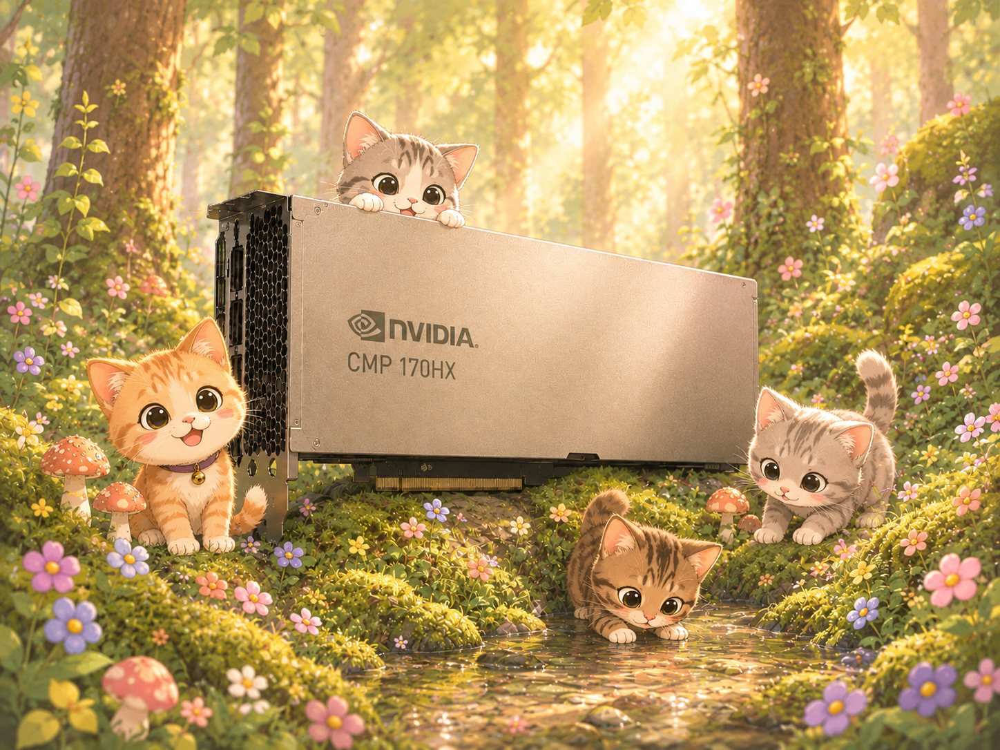
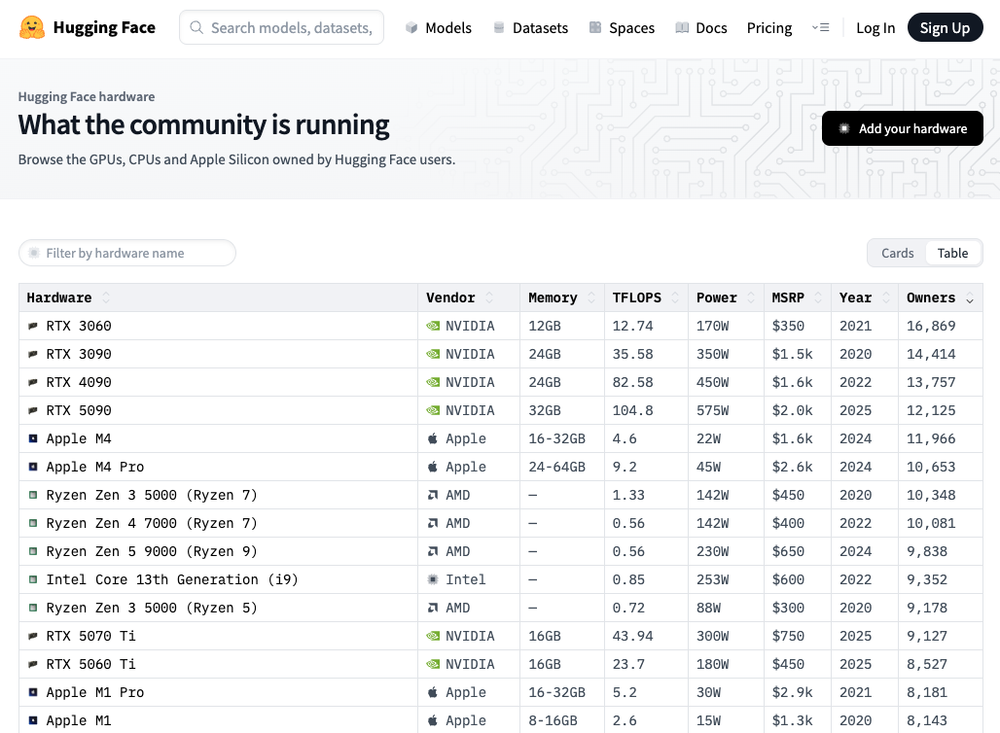

  

<h3 align="center">CMP 170HX</h3>

  <strong>Condemned to mine crypto. Reborn for LLM inference.</strong> 
  A community guide and worklog on optimizing the NVIDIA CMP 170HX for LLM inference.

> [!CAUTION]
> This repo is a work in progress! Feel free to check in on it frequently to see updates.

---

## What is it?

The CMP 170HX is a GPU from NVIDIA built for the express purpose of cryptocurrency mining. It was launched in the fall of 2021, starting at a launch price of $4299 USD.[^1] Today the CMP 170 HX can be found on eBay for ~$200 USD.

  
   
  <em>The CMP 170HX listed on eBay for ~$200 USD.</em>

The CMP 170HX is built on the TSMC 7nm process and on NVIDIA's Ampere architecture. It is built out of the same die (GA100) as NVIDIA's Ampere datacenter GPU, the A100, which is priced at around $10k USD now (fluctuating wildly these days). From here, most of the similarities with the A100 (and most other GPUs for that matter) end.[^1]

## What makes it different?

We can walk through the specs of a GPU in three parts: compute, memory, and everything else. We'll compare the 170HX against A100, as well as the RTX 3090 and the RTX 3060, two popular cards for local inference.

  
   
  <em>The <a href="https://huggingface.co/hardware?view=table">hardware</a> the Hugging Face community runs local inference on.</em>

### Compute

| | RTX 3060[^5] | RTX 3090[^2] | A100 (PCIe, 40 GB)[^3] | CMP 170HX[^1] |
|---|---|---|---|---|
| CUDA cores | 3,584 | 10,496 | 6,912 | 4,480 |
| Tensor cores | 112 | 328 | 432 | 280 |
| FP16 — tensor¹ | ~25 TFLOP/s | 71 TFLOP/s | 312 TFLOP/s | ~5 TFLOP/s ² |
| FP32 — CUDA cores | 12.7 TFLOP/s | 35.6 TFLOP/s | 19.5 TFLOP/s | 0.39 → 6.25 TFLOP/s ³ |
| BF16 — CUDA cores | 12.7 TFLOP/s | 35.6 TFLOP/s | 39 TFLOP/s | ~6.25 TFLOP/s ⁴ |
| FP16 — CUDA cores | 12.7 TFLOP/s | 35.6 TFLOP/s | 78 TFLOP/s | ~24.5 TFLOP/s ⁵ |

¹ Dense (non-sparse) tensor FP16, FP32-accumulate. The 3090 and 3060 FP16-accumulate rates are double (142 and ~51 TFLOP/s); the A100 has no such split. The 3060 is not in the GA102 whitepaper — its tensor figure is scaled from the GA10x per-Tensor-Core rate, other figures from [^5]. 
² Nominal ~150 TFLOP/s; the firmware gates the tensor path to roughly 1/32, so ~5 is the effective rate. 
³ Fused FP32 (FFMA) is firmware-throttled; compiling with -fmad=false (separate FMUL + FADD) recovers it. 
⁴ GA100 has a packed BF16 path (the A100's 39 = 2× FP32), but a bf16 SIMT GEMM with FP32 accumulate widens to FP32 and runs at the FP32 rate — hence converting GEMMs bf16→fp16. 
⁵ The path the throttle leaves alone (HFMA2). Measured register peak; the GA100 nominal is higher. 
The 3060, 3090, and A100 figures are nominal peaks (whitepapers / vendor specs). The 170HX compute figures are measured on this card[^4] — the throttle makes its nominal spec meaningless.

### Memory

| | RTX 3060[^5] | RTX 3090[^2] | A100 (PCIe, 40 GB)[^3] | CMP 170HX[^1] |
|---|---|---|---|---|
| Bandwidth | 360 GB/s | 936 GB/s | 1,555 GB/s | 1,493 GB/s |
| Capacity | 12 GB GDDR6 | 24 GB GDDR6X | 40 GB HBM2 | 8 GB HBM2e |

### Everything else

| | RTX 3060[^5] | RTX 3090[^2] | A100 (PCIe, 40 GB)[^3] | CMP 170HX[^1] |
|---|---|---|---|---|
| PCIe¹ | 4.0 ×16 (~32 GB/s) | 4.0 ×16 (~32 GB/s) | 4.0 ×16 (~32 GB/s) | 1.0 ×4 (~1 GB/s) |
| TDP | 170 W | 350 W | 250 W | 250 W ² |

¹ One-directional. The 170HX's Gen1 ×4 is firmware-locked. 
² Rated 250 W; the FMA power limiter holds real draw to ~80–115 W.

## AI Usage

I conducted all experiments and kernel optimizations in collaboration with Claude Opus [4.7](https://www.anthropic.com/news/claude-opus-4-7)/[4.8](https://www.anthropic.com/news/claude-opus-4-8).

I did not use any AI directly in any writing in this repo (i.e. all writing was done by me), but I used Opus to iterate on ideas and key points in my writing.

[GPT Image 2](https://openai.com/index/introducing-chatgpt-images-2-0/) was used to create the banner at the top of this README.

## Acknowledgements

## References

[^1]: NVIDIA CMP 170HX 8 GB — specifications. TechPowerUp GPU Database. <https://www.techpowerup.com/gpu-specs/cmp-170hx-8-gb.c3830>
[^2]: *NVIDIA Ampere GA102 GPU Architecture* whitepaper, v2 — RTX 3090 specifications in Appendix A (Table 9). NVIDIA, 2020. <https://www.nvidia.com/content/PDF/nvidia-ampere-ga-102-gpu-architecture-whitepaper-v2.pdf>
[^3]: *NVIDIA A100 Tensor Core GPU Architecture* whitepaper — A100 specifications in Table 4 (GA100). NVIDIA, 2020. <https://images.nvidia.com/aem-dam/en-zz/Solutions/data-center/nvidia-ampere-architecture-whitepaper.pdf>
[^4]: Measured on this card via the microbenchmarks in `benchmarks/`. No vendor profiler runs on the 170HX, so figures are wall-clock A/B and register-resident peaks.
[^5]: NVIDIA GeForce RTX 3060 12 GB — specifications. TechPowerUp GPU Database. <https://www.techpowerup.com/gpu-specs/geforce-rtx-3060.c3682>
